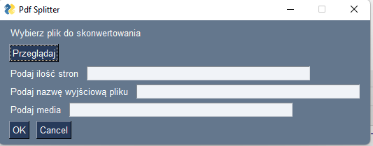

# Dillinger
## _The Last Markdown Editor, Ever_

[](https://nodesource.com/products/nsolid)

[](https://travis-ci.org/joemccann/dillinger)

# Splitter PDF
> Szybka, krótka apka do pogody. Wykorzystuje API 

## Menu
* [Informacje ogólne](#informacje-oglne)
* [Zrzut ekranu](#zrzut-ekranu)
* [Technologie](#technologie)
* [Instalacja](#instalacja)
* [Kod](#kod)
* [Plan rozwoju](#plan-rozwoju)
* [Status](#status)
* [Inspiracje](#inspiracje)
* [Kontakt](#kontakt)

## Informacje ogólne
Dla SM Budowlani aplikacja do rozdzielania plików pdf na kilka mniejszych. W zależności od ilości stron na plik.
Aplikacja ma usprawnić bieżącą obsługę mieszkańców.

## Zrzut ekranu


## Technologie
* Python

## Instalacja
* PY plik do uruchomienia na dowolnym systemie operacyjnym po wcześniejszej instalacji Python interpreter 

## Przykładowy kod


```                  while True:
        for f in glob.glob( recursive=True):
            if i >= input_pdf.numPages:
                break
            output = PdfFileWriter()
            for j in range(n_pages):
                if i + j >= input_pdf.numPages:
```


## Plan rozwoju

* EXE
* Wyjątki

## Status
Status projektu: _in progress_, 

## Inspiracje
Projekt autorski. Podziękowania za pomoc dla HyperScypion

## Kontakt
Wykonany przez [@ithelparturgolata](ithelparturgolata@gmail.com) 